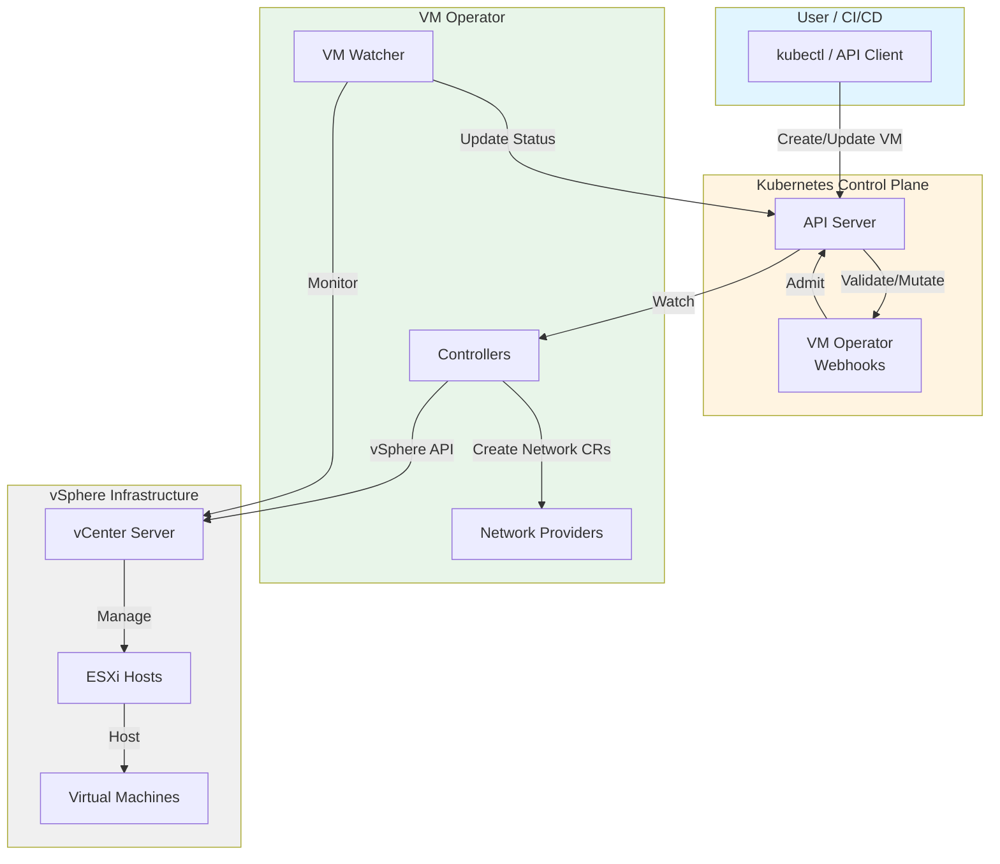

# Components

VM Operator consists of several key components that work together to manage virtual machines in Kubernetes.

## Architecture Overview

VM Operator supports two deployment architectures:

1. **Single vCenter (Monolithic)**: Traditional single-container deployment for managing VMs on one vCenter
2. **Multi-vCenter (Split Architecture)**: Distributed deployment with global and per-vCenter containers

For detailed information about the multi-vCenter architecture, see [Multi-vCenter Architecture](multi-vcenter-architecture.md).

## Core Components

### Controllers

VM Operator includes the following controllers:

#### Global Controllers (Shared Resources)

- **VirtualMachineClass Controller**: Manages VM sizing and configuration templates
- **VirtualMachineService Controller**: Manages load balancing and service endpoints for VMs
- **VirtualMachineReplicaSet Controller**: Manages VM replica sets for scaling

#### Per-vCenter Controllers (vCenter-Specific Resources)

- **VirtualMachine Controller**: Manages VM lifecycle (create, update, delete, power operations)
- **Zone Controller**: Manages availability zones and cluster resources
- **VirtualMachineSnapshot Controller**: Handles VM snapshot operations
- **VirtualMachinePublishRequest Controller**: Publishes VMs to content libraries
- **VirtualMachineWebConsoleRequest Controller**: Provides web console access to VMs
- **ContentLibrary Controllers**: Synchronize and manage vSphere content libraries
- **VirtualMachineImage Controllers**: Manage VM image lifecycle

### Webhooks

Admission webhooks provide validation and mutation of VM Operator resources:

- **Mutation Webhooks**: Set defaults, inject labels, normalize specifications
- **Validation Webhooks**: Enforce business rules, validate configurations
- **Admission Webhooks**: Custom admission logic for resource requests

In multi-vCenter deployments, all webhooks run in the global container.

### Services

- **VM Watcher Service**: Real-time monitoring of VM state changes in vCenter
- **Metrics Service**: Prometheus metrics endpoint for monitoring
- **Health Service**: Liveness and readiness probes

### Network Providers

VM Operator supports multiple network provider types:

- **Named Networks**: Direct vSphere network references
- **NetOP (VDS)**: Integration with net-operator for VDS networks
- **NCP (NSX-T)**: Integration with NSX-T Container Plugin
- **VPC (NSX-T)**: Integration with NSX-T VPC

See [Multi-vCenter Architecture - Network Interface Management](multi-vcenter-architecture.md#network-interface-management) for detailed network provider information.

## Component Interactions

## Deployment Modes

### Monolithic Deployment

Single container running all components:

- All controllers in one process
- Single vCenter connection
- Webhooks included
- Suitable for single vCenter environments

### Split Architecture Deployment

Multiple containers with specialized roles:

- **Global Container**: Webhooks + shared controllers
- **Per-vCenter Containers**: VM controllers + vCenter connections
- Suitable for multi-vCenter environments
- Horizontal scaling per vCenter

See [Multi-vCenter Architecture](multi-vcenter-architecture.md) for complete details.

## Configuration

VM Operator is configured through:

1. **Environment Variables**: Container configuration (vCenter UUID, network provider, feature flags)
2. **ConfigMaps**: vCenter connection details, provider settings
3. **Secrets**: vCenter credentials
4. **Command-Line Flags**: Manager options (metrics port, webhook port, leader election)

For configuration details, see [Manager Configuration](../ref/config/manager.md).

## References

- [Multi-vCenter Architecture](multi-vcenter-architecture.md) - Detailed architecture documentation
- [Virtual Machine Concepts](workloads/vm.md) - VM resource documentation
- [Network Configuration](services-networking/guest-net-config.md) - Network setup guide
- [API Reference](../ref/api/v1alpha5.md) - Complete API documentation